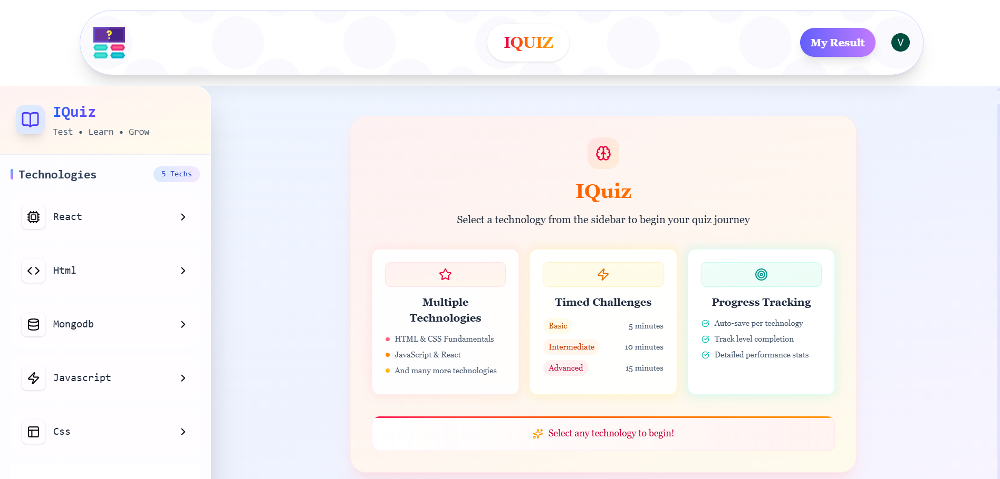
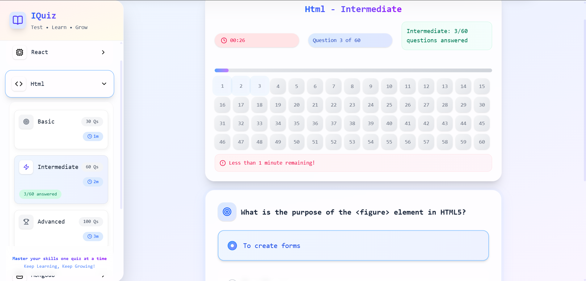
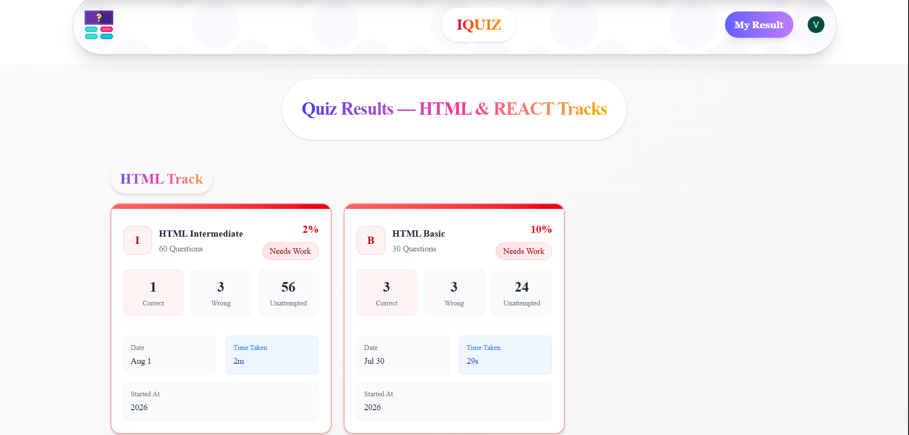
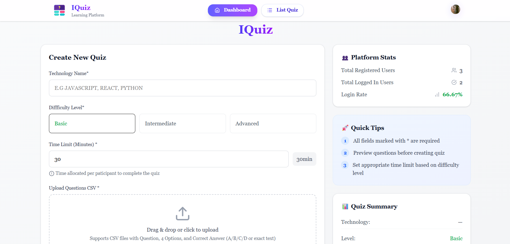
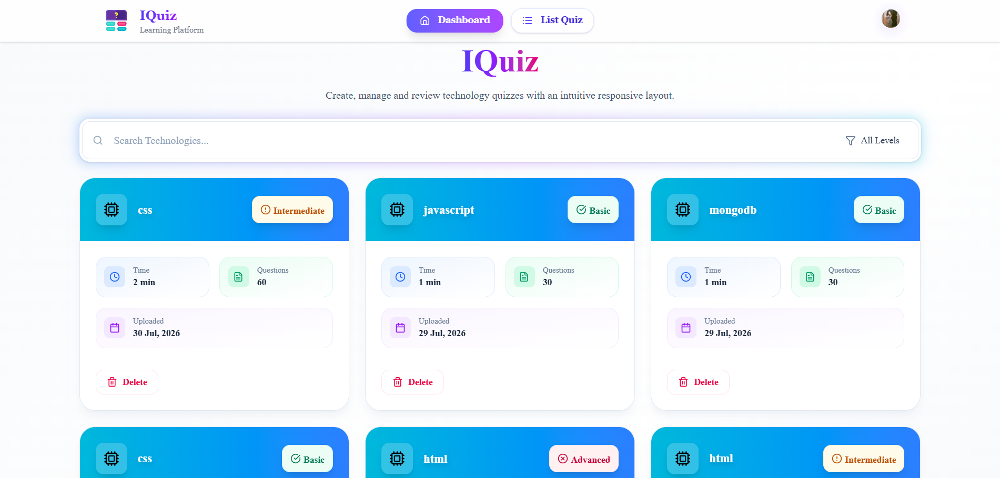

# IQuiz

IQuiz is a full-stack quiz platform that allows users to test their knowledge through technology-based quizzes while providing administrators with tools to create and manage quizzes.

## Demo Access

- **User Application:** https://iquiz-web.vercel.app
- **Admin Panel:** https://iquiz-admin.vercel.app

**Admin Access:** Restricted to the project owner for security purposes. The Admin Dashboard uses role-based authorization, and only authorized administrator accounts can manage quizzes.

## Screenshots

### User Application

#### Home Page

#### Quiz Page

#### Result Page

### Admin Panel

#### Dashboard

#### List Quiz

## Features

- Secure authentication using Clerk
- Role-based access for Admin and Users
- Create quizzes by uploading CSV files
- Timed quiz attempts
- Multiple difficulty levels
- View quiz results and performance
- Responsive design for desktop and mobile

## Tech Stack

- React
- Vite
- Tailwind CSS
- Node.js
- Express.js
- MongoDB Atlas
- Mongoose
- Clerk Authentication

## Project Structure

- **Frontend** – User quiz application
- **Admin** – Quiz management dashboard
- **Backend** – REST API and database logic

## About the Project

This project was built to strengthen my full-stack development skills by implementing authentication, role-based authorization, REST APIs, MongoDB integration, CSV file processing, and responsive UI design in a real-world application.

---
Developed by **Vanshika Sharma**
